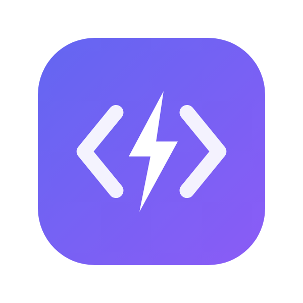
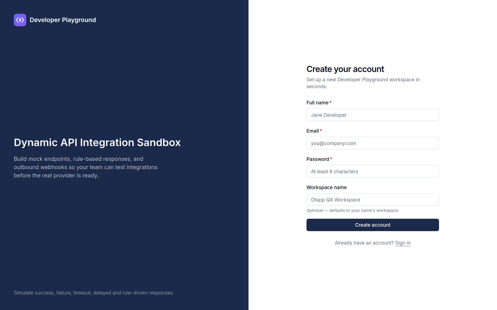
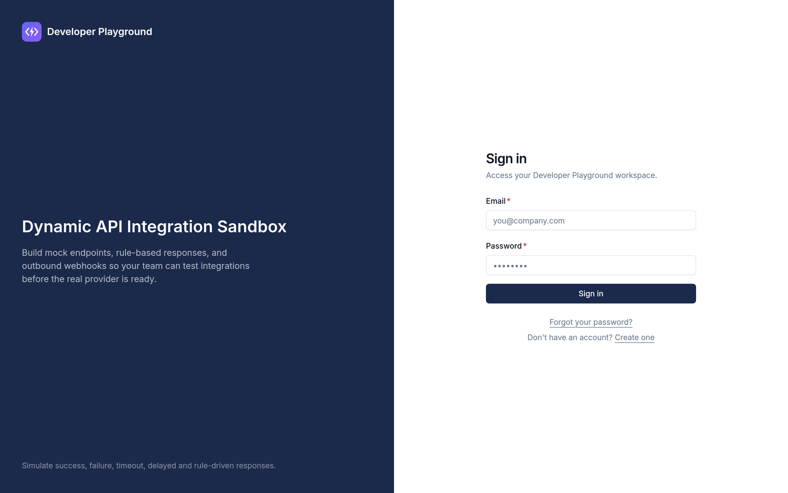
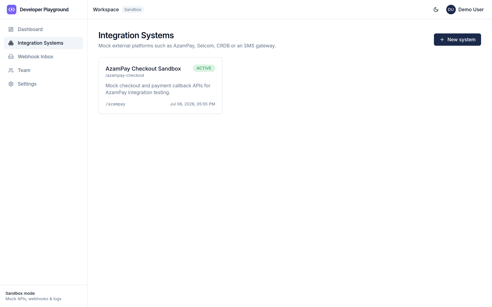
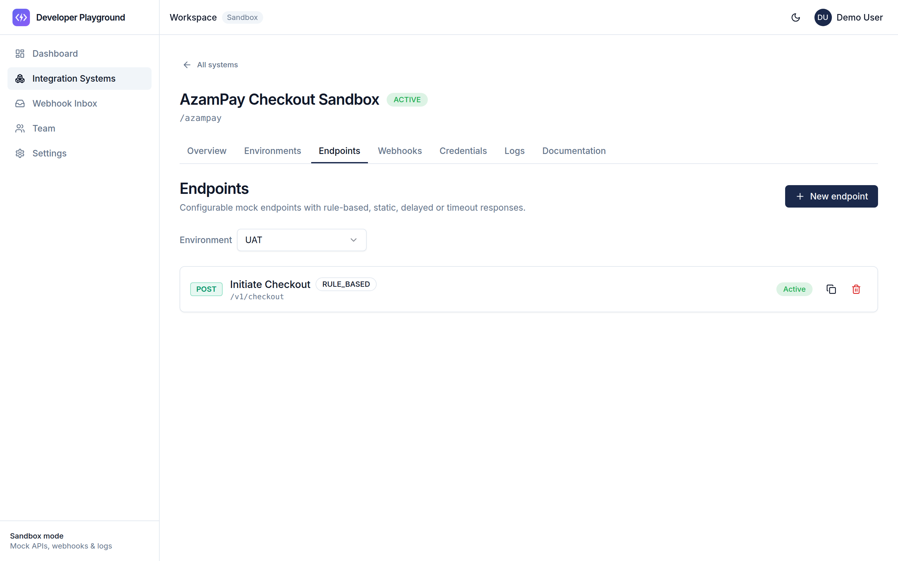
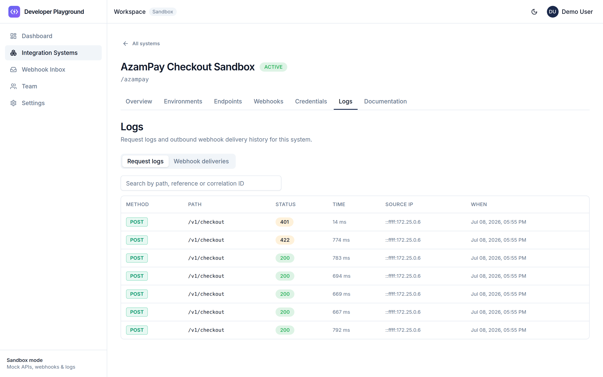
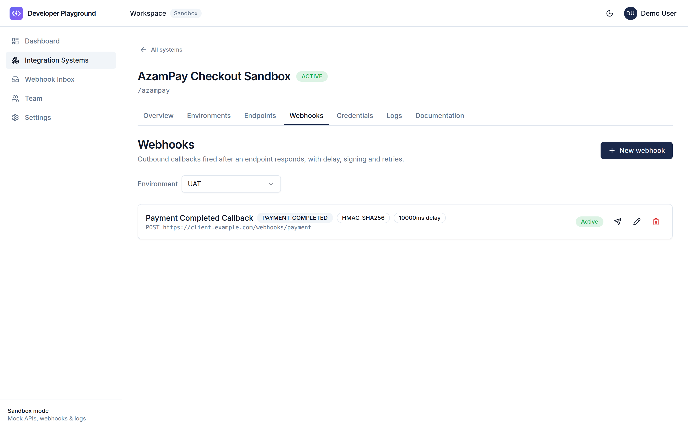
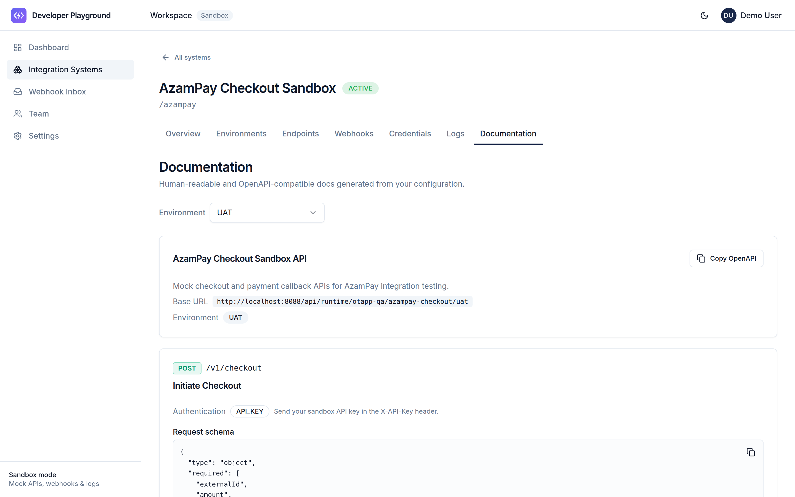
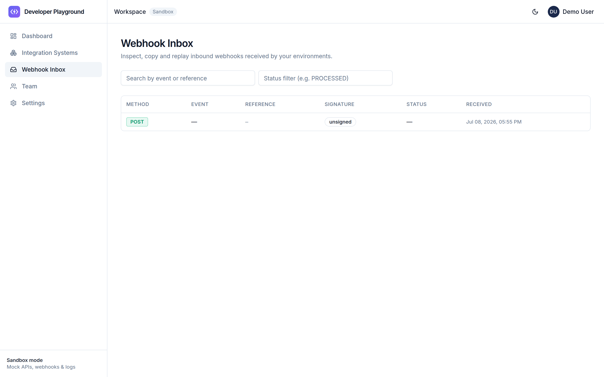

<p align="center">
  
</p>

<h1 align="center">Developer Playground</h1>
<p align="center"><strong>Dynamic API Integration Sandbox</strong></p>

> Create and test mock APIs for third-party integrations — without waiting for
> the real provider. Define endpoints, rules, authentication, and webhooks from
> a web portal; the sandbox serves them instantly at a generated URL.

<p>
  
  
  
  
  
  
  
  
</p>

Developer Playground lets developers and QA teams simulate systems like AzamPay, Selcom,
CRDB, ERP, Cargo, BMS, or an SMS gateway: create an **Integration System**,
add **environments**, build **dynamic endpoints** with static or rule-based
responses, wire up **outbound webhooks**, receive **inbound webhooks**, and
inspect every **request and delivery log** — all before a production API exists.

---

## Table of contents

- [Features](#features)
- [Screenshots](#screenshots)
- [Architecture](#architecture)
- [Monorepo layout](#monorepo-layout)
- [Quick start](#quick-start)
- [Tech stack](#tech-stack)
- [Documentation](#documentation)
- [What's implemented vs Phase Two](#whats-implemented-vs-phase-two)

---

## Features

**MVP scope** (spec §17) — the first release delivers:

- 🔐 **User authentication** and workspace creation
- 🧩 **Integration Systems** — create, edit, activate/deactivate, archive
- 🌱 **Environments** per system with generated base URLs and variables
- ⚡ **Dynamic endpoints** — live the moment they're created, no redeploy
- 📦 **Static** and 🧠 **rule-based** response payloads (priority-ordered rules)
- 🗝️ **API-key authentication** on sandbox endpoints (Basic / Bearer / HMAC also modeled)
- ⏱️ **Response delay simulation**
- 📤 **Outbound webhooks** delivered by a background worker (with delay + retries)
- 📥 **Inbound webhook receiver** with capture, inspect, and replay
- 📊 **Request & webhook logs**, searchable, with per-delivery detail
- 🔁 **Manual webhook retry**
- 🧾 **Generated cURL examples** and **OpenAPI export**

See the full picture in [docs/api-overview.md](docs/api-overview.md).

---

## Screenshots

The portal in action — sign-up, endpoint builder, live request logs, and webhook tooling.

|  |  |
|:--:|:--:|
| **Create account** — self-service sign-up spins up a new workspace | **Sign in** |
| [](docs/screenshots/01b-register.png) | [](docs/screenshots/01-login.png) |
| **Integration Systems** — one card per simulated provider | **Endpoints** — dynamic mock endpoints, live on save |
| [](docs/screenshots/03-systems.png) | [](docs/screenshots/04-endpoints.png) |
| **Request logs** — every call captured with status, timing & matched rule | **Outbound webhooks** — targets, payload templates, retries & signing |
| [](docs/screenshots/05-request-logs.png) | [](docs/screenshots/06-webhooks.png) |
| **Generated documentation** — shareable API docs & cURL examples | **Webhook inbox** — inspect & replay inbound callbacks |
| [](docs/screenshots/07-documentation.png) | [](docs/screenshots/08-webhook-inbox.png) |

> Captured from a live run of the stack against the seeded AzamPay checkout example.

---

## Architecture

Three deployable apps and four shared packages, fronted by Nginx:

```text
                 :80
   Browser ─────► nginx ──► /   ─► web    (Next.js  :3000)
   Client ──────►       └─► /api ─► api    (NestJS   :4000) ──► postgres
   Webhook ─────►                            │                └► redis ─► worker ─► callback URL
                                       runtime · portal · receiver · docs
```

- **api** exposes four surfaces: portal API (`/api/v1`), dynamic runtime
  (`/api/runtime`), inbound receiver (`/api/webhook-receiver`), and Swagger
  (`/api/docs`).
- **worker** consumes BullMQ queues from Redis to deliver (and retry) webhooks
  off the request thread.
- **web** is the portal UI.
- **postgres** stores all domain data and logs; **redis** backs queues, caching,
  rate limiting, and sequence/idempotency state.

Full diagrams and component responsibilities:
[docs/architecture.md](docs/architecture.md).

---

## Monorepo layout

```text
developer-playground/
├── apps/
│   ├── api/                 # NestJS backend  (@developer-playground/api)
│   ├── web/                 # Next.js frontend (@developer-playground/web)
│   └── worker/              # BullMQ webhook worker (@developer-playground/worker)
├── packages/
│   ├── database/            # Prisma schema + shared client (@developer-playground/database)
│   ├── shared-types/        # Shared TypeScript interfaces
│   ├── validation/          # Shared Zod schemas
│   ├── template-engine/     # Dynamic {{variable}} renderer
│   └── eslint-config/       # Shared lint config
├── docker/                  # api / worker / web Dockerfiles + nginx.conf
├── docs/                    # architecture · getting-started · deployment · security · api-overview
├── .github/workflows/       # ci.yml (lint/build/test + integration) · docker.yml
├── docker-compose.yml       # postgres · redis · api · worker · web · nginx
├── Makefile                 # make up / down / migrate / seed / dev / logs
├── package.json             # pnpm workspace root
├── pnpm-workspace.yaml
└── README.md
```

---

## Quick start

### Prerequisites

- **Node.js ≥ 20** and **pnpm 9.12** (`corepack enable`)
- **Docker + Docker Compose**

### Option A — full stack in Docker

Everything (api, worker, web, nginx, postgres, redis) behind Nginx on port 80:

```bash
cp .env.example .env      # then change the secrets
make up                   # build + start; migrations run automatically
```

- Portal: **http://localhost**
- API + Swagger: **http://localhost/api** · **http://localhost/api/docs**

`make down` stops it, `make logs` follows output, `make clean` wipes volumes.

### Option B — apps on the host (recommended for development)

```bash
corepack enable
pnpm install                       # install the workspace
cp .env.example .env               # configure env (change secrets)
make infra                         # start only postgres + redis
make migrate-dev && make seed      # migrate + seed the database
pnpm dev                           # run api + worker + web in watch mode
```

- Portal: **http://localhost:3000** · API: **http://localhost:4000**

Full walkthrough and troubleshooting:
[docs/getting-started.md](docs/getting-started.md).

---

## Tech stack

| Layer | Technology |
|---|---|
| **Backend** | Node.js, NestJS, TypeScript, Prisma, PostgreSQL |
| **Queues / cache** | Redis, BullMQ (delayed jobs, webhook delivery, retries) |
| **Validation** | Zod / JSON Schema |
| **Auth** | JWT (portal); API key / Basic / Bearer / HMAC (sandbox) |
| **Frontend** | Next.js (App Router), TypeScript, Tailwind, shadcn/ui, React Hook Form, TanStack Query, Monaco Editor |
| **Docs** | Swagger / OpenAPI |
| **Infra** | Docker, Docker Compose, Nginx, GitHub Actions |
| **Tooling** | pnpm workspaces, TypeScript project references |

---

## Documentation

| Doc | What's inside |
|---|---|
| [architecture.md](docs/architecture.md) | System + sequence diagrams, component responsibilities, scalability |
| [getting-started.md](docs/getting-started.md) | Local dev: prerequisites, install, migrate/seed, run apps |
| [deployment.md](docs/deployment.md) | Docker Compose prod, env & secrets, migrations, retention, rate limiting, scaling |
| [security.md](docs/security.md) | Each spec §15 control mapped to how/where it's addressed |
| [api-overview.md](docs/api-overview.md) | Runtime URL scheme, auth types, response modes, template variables, webhook flow |

---

## What's implemented vs Phase Two

**In the MVP** (spec §17): authentication, workspaces, integration systems,
environments, dynamic endpoints, **static + rule-based** responses, API-key
auth, delay simulation, outbound webhooks with retry, inbound receiver, request
& webhook logs, manual retry, cURL examples, and OpenAPI export.

> **Deliberately excluded from the MVP:** unrestricted **scripted responses** —
> arbitrary code execution is a security risk and is deferred until it can run
> in a sandboxed isolate (spec §15/§17).

**Phase Two** (spec §18) — planned enhancements, not yet built:

- Random & sequence response modes · restricted scripted responses
- GraphQL sandbox · SOAP/XML mocks · file upload / multipart · WebSocket events
- Import OpenAPI → endpoints · export system as JSON · clone/share templates
- Team collaboration & comments · test scenarios & automated runs · contract testing
- Faker-based mock data · scheduled state changes · custom domains
- IP allowlisting · HMAC verification UI · webhook payload diffing

---

Built as a pnpm monorepo. Contributions follow the workspace conventions in
[docs/getting-started.md](docs/getting-started.md); CI (lint, build, unit +
integration tests, image builds) runs on every push and PR.
