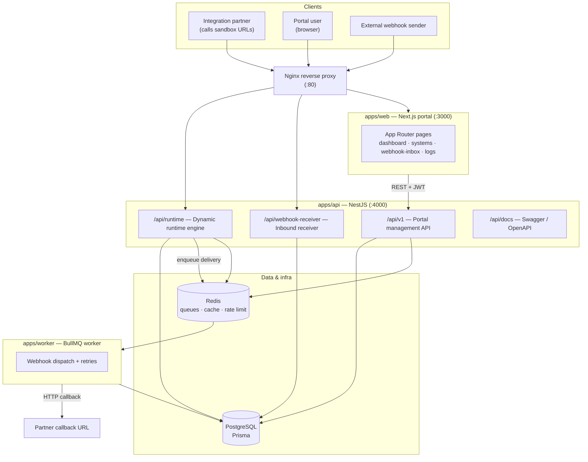
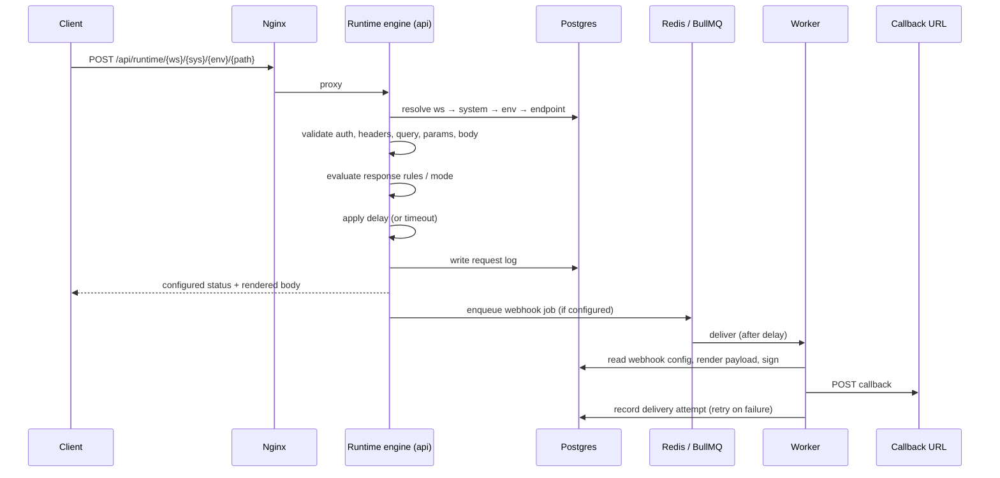

# Architecture

Developer Playground is a **pnpm monorepo** with three deployable apps sharing four
libraries. This document maps the runtime topology to the backend module
structure (spec §13) and frontend route structure (spec §14).

## System diagram

## Request lifecycles

### Dynamic runtime call (spec §4)

## Component responsibilities

### apps/api — `@developer-playground/api` (NestJS, port `API_PORT`, default 4000)

Hosts four HTTP surfaces:

| Surface | Base path | Responsibility |
|---|---|---|
| Portal API | `/api/v1` | CRUD for systems, environments, endpoints, response rules, webhooks, credentials, logs (spec §11). JWT-authenticated, RBAC-scoped per workspace. |
| Dynamic runtime | `/api/runtime` | Resolves and executes mock endpoints without redeploy (spec §4). |
| Webhook receiver | `/api/webhook-receiver` | Captures inbound webhooks (spec §8.2). |
| API docs | `/api/docs` | Swagger UI + generated OpenAPI (spec §10.9). |

Key services from spec §13: `RuntimeResolverService`, `RequestValidatorService`,
`AuthenticationValidatorService`, `RuleEvaluationService`,
`TemplateRendererService`, `ResponseSimulationService`, `WebhookDispatchService`
(enqueues), `WebhookSignatureService`, `RequestLoggingService`,
`CredentialService`.

### apps/worker — `@developer-playground/worker` (BullMQ, no HTTP port)

Consumes queues from Redis. Owns the outbound webhook delivery flow (spec §8.1):
waits for the configured delay, renders the payload template, signs when
enabled, sends the callback, records the attempt, and retries failed deliveries
with exponential backoff. Restart-safe and independently scalable (spec §16).

### apps/web — `@developer-playground/web` (Next.js App Router, port 3000)

The portal UI (spec §10 / §14): dashboard, integration systems, environment
management, API builder, webhook builder, request/webhook logs, webhook inbox,
and generated documentation viewer. Talks to the API over REST with a JWT;
`NEXT_PUBLIC_API_BASE_URL` points it at the API (via nginx `/api` in Docker).

### packages/*

| Package | Purpose |
|---|---|
| `@developer-playground/database` | Prisma schema + shared `PrismaClient` (spec §12). Single source of truth for the data model, consumed by api, worker and seeds. |
| `@developer-playground/shared-types` | Shared TypeScript interfaces across apps. |
| `@developer-playground/validation` | Shared Zod schemas for request/DTO validation. |
| `@developer-playground/template-engine` | Dynamic variable renderer for `{{...}}` template variables (spec §7), used by both the runtime (response bodies) and the worker (webhook payloads). |

### Infrastructure

- **Nginx** — single public entrypoint on `:80`; `/api/` → api, `/` → web, with
  websocket upgrade for Next HMR and a coarse edge rate-limit hook (spec §15/§16).
- **PostgreSQL** — durable store for all domain data and logs.
- **Redis** — BullMQ queues, rate-limit counters, caching, and persistent
  sequence/idempotency state (spec §16).

## Scalability notes (spec §16)

The three apps scale independently: the portal API, the runtime, and the workers
are separate processes. The runtime resolves endpoints via indexed lookups
(`@@unique([environmentId, method, path])`) with room for a Redis cache layer.
Webhook processing runs entirely off the request thread. Request logs can later
move to a dedicated logging store without touching the runtime.
